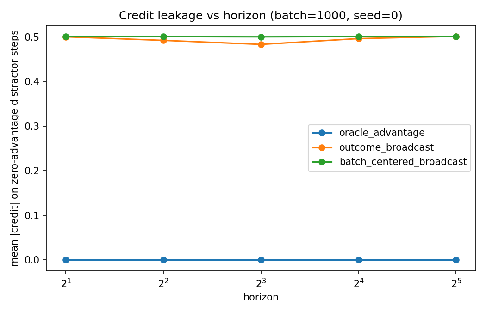
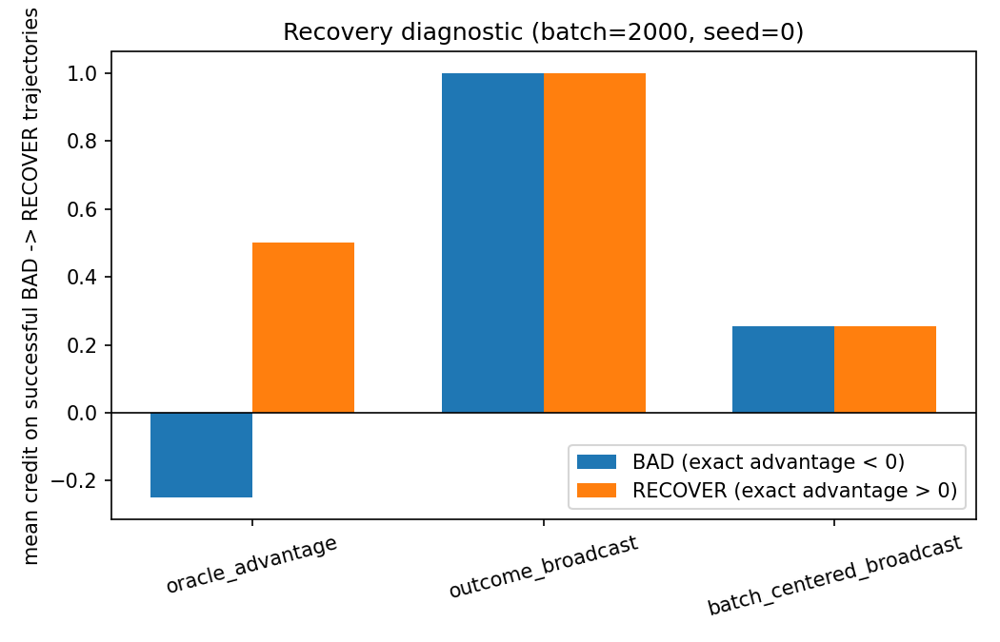
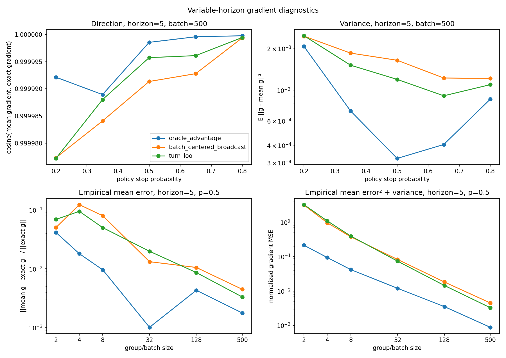
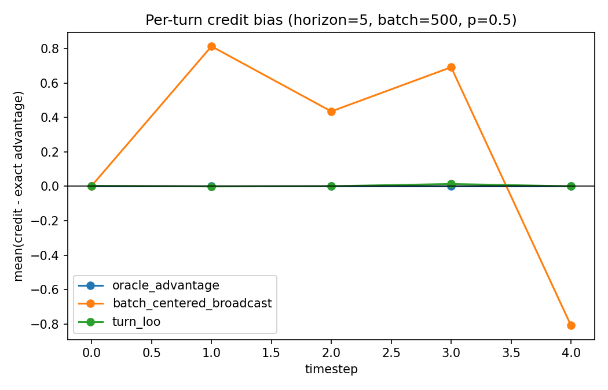
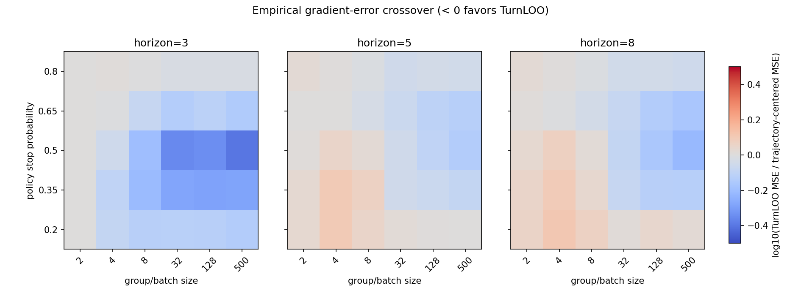
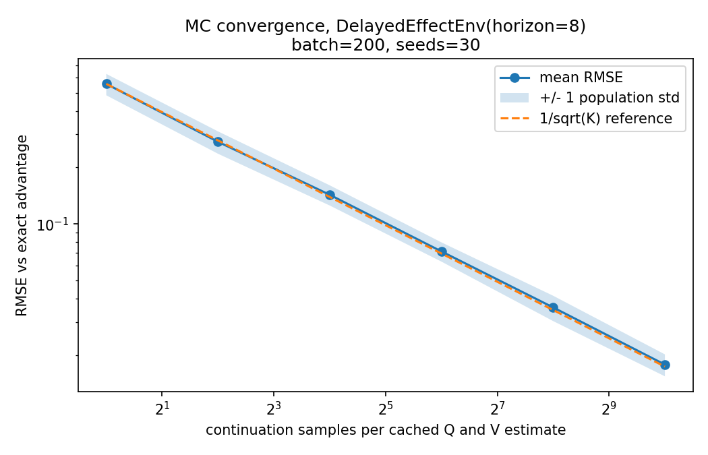

# AgentCreditBench

[](https://github.com/hectopascal/agent-credit-bench/actions/workflows/ci.yml)
[](https://github.com/hectopascal/agent-credit-bench/releases)
[](https://doi.org/10.5281/zenodo.22178938)
[](LICENSE)

**Unit tests for turn-level credit assignment in agentic reinforcement learning.**

AgentCreditBench evaluates credit estimators on tiny finite-horizon MDPs with exact policy-advantage oracles.
It tests two separate questions:
- Does the estimator correctly identify which actions helped or hurt?
- Does it still induce the correct policy-gradient signal?

The core suite runs on CPU with zero runtime dependencies and includes
conformance paths for verl, TRL, OpenRLHF, and verifiers.

**[Explore the benchmark](https://hectopascal.github.io/agent-credit-bench/)** ·
[Read the validation report](docs/validation_report.md) ·
[View the committed evidence](results/)

## Why credit estimators need unit tests

Turn-level credit assignment methods for agentic RL are usually validated
indirectly — by end-task success on agent benchmarks, or against approximate
Monte-Carlo ground truth. Both are noisy and confounded. Here the MDPs are
small enough that `A^pi(s, a)` is exact, so an estimator's output can be
scored directly, on CPU, in seconds.

This differs from bsuite-style diagnostics (which score *agents* via learning
curves — no training loop exists here) and from method papers (which propose
estimators; this scores them).

## When to use AgentCreditBench

Use AgentCreditBench to:

- validate a turn-level or step-level credit estimator against exact
  policy advantages;
- test whether GRPO, RLOO, GAE, GiGPO, or custom framework code leaks
  credit onto irrelevant turns;
- distinguish per-action credit quality from expected policy-gradient
  validity;
- run conformance tests against implementations in verl, TRL,
  OpenRLHF, and verifiers.

## A simple conditional-credit diagnostic

Conditioning on successful `BAD -> RECOVER` trajectories in the recovery
environment gives (default regenerated run: batch 2,000, 30 seeds):

| estimator                | credit(BAD) | credit(RECOVER) | both positive on selected path |
| ------------------------ | ----------- | --------------- | ------------------------------ |
| oracle_advantage         | −0.25       | +0.50           | 0%                             |
| outcome_broadcast        | +1.00       | +1.00           | 100%                           |
| batch_centered_broadcast | +0.25       | +0.25           | 100%                           |
| grpo_style_normalized    | +0.58       | +0.58           | 100%                           |
| gigpo_style              | +1.15       | +1.57           | 100%                           |

The table exposes an identification limitation after selecting only successful
repaired trajectories. Flat broadcasts assign the mistake and repair the same
positive value. GiGPO-style anchor-state grouping distinguishes their
magnitudes, but still gives BAD positive credit on this selected path.

It is **not**, by itself, evidence of a biased expected policy gradient.
Selection on success changes the estimand. Under the uniform evaluation policy,
the exact mean advantage over *all* BAD actions is −0.25, and the expected
BatchCentered/RLOO credit over all BAD actions is also −0.25: positive credit
on recovered BAD cases is offset by negative credit on unsuccessful BAD cases.
The recovery experiment now reports both the selected-path values and the
all-BAD aggregate, plus gradient alignment, so users can distinguish
credit-value interpretation from training-signal validity.

## Installation

The package is not published on PyPI yet. Install it from the source checkout:

```bash
git clone https://github.com/hectopascal/agent-credit-bench.git
cd agent-credit-bench
python -m venv .venv
source .venv/bin/activate
python -m pip install -e ".[dev]"           # + pytest, ruff
python -m pip install -e ".[experiments]"   # + matplotlib, for figures
```

Zero runtime dependencies; Python >= 3.10.

## Quick start

```python
from agent_credit_bench import run_benchmark, UniformPolicy
from agent_credit_bench.envs import DelayedEffectEnv
from agent_credit_bench.estimators import BatchCenteredBroadcast

result = run_benchmark(
    mdp=DelayedEffectEnv(horizon=16),
    policy=UniformPolicy(),
    estimator=BatchCenteredBroadcast(),
    batch_size=1_000,
    seeds=range(10),
)
print(result.mean_gradient_cosine, result.seed_metrics[0].leakage_ratio)
```

## Environments

- **DelayedEffectEnv** — one consequential first action, then behaviorally
  identical distractors with exactly zero advantage; delayed terminal reward.
- **RecoveryEnv** — an early mistake repaired by a later action; compares
  selected successful-path credit with all-action and gradient aggregates.
- **VariableHorizonEnv** — STOP/CONTINUE at every turn; continuing has
  positive advantage at some timesteps and negative at others.

## Estimators

- **OracleAdvantage** — exact advantage; the exact-credit anchor.
- **OutcomeBroadcast** — trajectory return broadcast to every step (naive).
- **BatchCenteredBroadcast** — leave-one-out group-centered return, broadcast
  (a minimal group-relative baseline; not a full GRPO implementation).
- **TurnLOO** — leave-one-out baseline over trajectories still active at
  each timestep; falls back to raw-return REINFORCE when no peer survives.
- **GRPOStyleNormalized** — the published GRPO group formula:
  (return − mean) / (std + eps), broadcast.
- **GiGPOStyle** — hierarchical episode + anchor-state step grouping, after
  GiGPO's mechanism.
- **MonteCarloAdvantage** — Q − V from sampled continuations; converges to
  the oracle as rollouts grow.
- **TrajectoryReturnAdapter** — wraps any `f(returns) -> credits` function
  (e.g. the actual TRL/verl group-advantage computation) so external library
  code can be scored without adding dependencies here.

## Scoring real framework implementations

With optional extras, the suite runs directly against the advantage code of
three frameworks — [verl](https://github.com/volcengine/verl)'s importable
`core_algos` functions, [TRL](https://github.com/huggingface/trl)'s
trainer math (transcribed and pinned to the installed source by fingerprint
tests), and [OpenRLHF](https://github.com/OpenRLHF/OpenRLHF)'s full
`compute_advantages_and_returns` pipeline — not the "-style"
reimplementations above:

```bash
# From the AgentCreditBench source checkout:
python -m pip install -e ".[verl]"   # or .[trl]; torch CPU is sufficient
python experiments/cross_framework_conformance.py
```

The committed three-framework table is a protocol-checked merge from
separately pinned environments; use the script's documented `--merge-input`
workflow when exact dependency sets cannot coexist.

Selected rows (batch 2,000, seed 0, conditioned on successful
`BAD -> RECOVER`; full table in
`results/cross_framework_recovery.csv`):

| estimator                             | credit(BAD) | credit(RECOVER) | both positive on selected path |
| ------------------------------------- | ----------- | --------------- | ------------------------------ |
| oracle_advantage                      | −0.25       | +0.50           | 0%                             |
| verl_grpo                             | +0.59       | +0.59           | 100%                           |
| trl_grpo                              | +0.59       | +0.59           | 100%                           |
| openrlhf_group_norm                   | +0.59       | +0.59           | 100%                           |
| RLOO (verl / TRL / OpenRLHF)         | +0.26       | +0.26           | 100%                           |
| verl_gae_exact_lam1                   | +0.56       | +1.10           | 100%                           |
| verl_gae_exact_lam0                   | −0.69       | +1.42           | 0%                             |

Three implementation findings survive re-validation. First, each
outcome-grouped row gives BAD positive credit **on the selected successful
path**; this is the same conditional identification behavior as the core
diagnostic, not a claim that its expected gradient rewards BAD. Second, in
this terminal-reward, γ = 1 setup, GAE with an exact critic does the same at
λ = 1 because the critic then acts only as a baseline; λ = 0 uses the
one-step bootstrap and separates the two signs. Third, for groups of at
least two, the three RLOO implementations numerically agree within 1e-9 on
the tested batches (and match this suite's `BatchCenteredBroadcast`), while
the three GRPOs share the formula but not the epsilon (verl 1e-6, TRL 1e-4,
OpenRLHF 1e-9). Details, reward
layout constraints, and more findings per framework:
[docs/verl_integration.md](docs/verl_integration.md),
[docs/trl_integration.md](docs/trl_integration.md),
[docs/openrlhf_integration.md](docs/openrlhf_integration.md). The
integrations stay out of the core: zero runtime dependencies without the
extras. A skipped optional test is not compatibility evidence, so validation
requires installing the documented target version and running its dedicated
test. Dedicated CI jobs are defined for verl, TRL, verifiers, and OpenRLHF;
OpenRLHF's package path is Linux-x86_64-only.

Going further, [recipes/verl_bridge](recipes/verl_bridge/) runs suite
environments *inside* a real verl training run as multi-turn chat games:
a registered agent loop plays the MDP with a live model, logs episodes,
and `analyze_checkpoint.py` scores the configured core estimators and
installed adapters against exact advantages under a fitted empirical policy.
More precisely, logged histories
are collapsed to action frequencies at each `(t, state)`, and backward
induction is exact for that finite-sample Markov projection. It is not an
exact oracle for the original history-conditioned LLM policy, and sparse
action counts add estimation error. This still makes the bridge useful for
replaying real framework data through a transparent, explicitly scoped
tabular oracle.
[recipes/verifiers_bridge](recipes/verifiers_bridge/) does the same for
[verifiers](https://github.com/PrimeIntellect-ai/verifiers) (the
environment library behind prime-rl and the Environments Hub) as a
`MultiTurnEnv` with a `load_environment` entry point. The framework-free
half of both bridges (`agent_credit_bench.integrations.bridge`) also works
with any text-in/text-out model, no framework required.

## Metrics: two families

Exact advantage plus any state-dependent shift `b(t, s)` yields the same
expected policy gradient, so a single scalar misgrades estimators:

- **Identification** — is the output literally an advantage estimate?
  RMSE, Spearman rank correlation, sign accuracy, zero-credit leakage.
- **Gradient validity** — does it induce the right training signal?
  Centered (shift-invariant) RMSE, mean-gradient cosine,
  relative mean-gradient error `||mean(g_hat)-g*||/||g*||`, and variance under
  a tabular softmax parameterization.

## Results



*Delayed-effect horizon sweep. Broadcast estimators place nonzero credit on
irrelevant turns: per-turn leakage stays roughly constant, total distractor
credit grows with horizon, and its share approaches 0.97. Exact oracle credit
remains zero.*

Under the default protocol (uniform policy, batch 1,000, seeds 0–9,
`p_good=0.8`, `p_bad=0.2`), the two unnormalized broadcasts,
`OutcomeBroadcast` and `BatchCenteredBroadcast`, put about 0.5 mean absolute
credit on every zero-advantage distractor. That *per-distractor*
quantity stays flat, while total absolute distractor credit per episode grows
linearly and the leakage ratio rises from 0.5 at horizon 2 to 0.96875 at
horizon 32. GRPO- and GiGPO-style normalization changes the numerical scale
(and produces larger absolute values here), but not the structural smearing
across irrelevant turns. The oracle is exactly zero on all three leakage
measures.



*Selected successful `BAD -> RECOVER` trajectories. Exact advantage assigns
−0.25 to BAD and +0.50 to RECOVER. Broadcast estimators credit both positively;
GiGPO separates their magnitudes but still credits BAD positively on this
selected slice.*

The conditional-credit table above, as a figure. The accompanying CSV also
reports mean credit over all BAD actions and batch-gradient alignment; the
figure alone should not be read as an expected-gradient result.



*Variable-horizon gradient diagnostics compare direction, variance, relative
mean error, and normalized gradient MSE across stop probabilities and batch
sizes.*



*Per-turn credit bias reveals the timestep-dependent mis-centering hidden by a
whole-trajectory baseline.*



*The gradient-error frontier shows where TurnLOO or trajectory centering has
lower normalized finite-batch gradient MSE.*

The original batch-500-only result hid a correctness bug: when no peer
survived to a timestep, TurnLOO emitted zero and deleted that timestep's
REINFORCE contribution. On the five-step environment at stop probability
0.5 (5,000 seeds), the old rule gave mean-gradient cosine / relative
mean-gradient error of 0.9743 / 0.2254 at batch 2, 0.9886 / 0.1514 at batch 4,
and 0.9957 / 0.0929 at batch 8.

TurnLOO now uses raw return when the leave-one-out baseline is unavailable.
Exact enumeration verifies its expected gradient against the oracle for
batches 1–3. Re-running the wider 200-seed sweep shows the tradeoff the old
single setting missed: at horizon 5 and stop probability 0.5, TurnLOO has
higher normalized gradient MSE than trajectory-centering at batches 2, 4,
and 8, then lower MSE at batches 32, 128, and 500. At large batches it also
removes the pronounced per-timestep value mis-centering of a whole-batch
baseline. The corrected contribution is therefore a batch- and horizon-aware
calibration/variance diagnostic, not a universal empirical null or a blanket
win. Full protocols and numbers are in
[docs/turn_conditioning_note.md](docs/turn_conditioning_note.md); the focused
old-versus-corrected reproduction is committed as
`results/turn_loo_fallback_audit.csv`.



*Monte Carlo advantage converges toward the exact oracle at the expected
inverse-square-root sampling rate.*

Across seeds 0–29 (uniform policy, batch 200, horizon 8, `p_good=0.8`,
`p_bad=0.2`), K=256 continuation samples for each cached `Q(t,s,a)` and
`V(t,s)` estimate give mean RMSE 0.0359 ± 0.0055 (population standard
deviation). At K=1,024 the mean is 0.0178 ± 0.0024. Primary-batch and
continuation RNG streams use distinct recorded seeds. The curve is consistent
with the expected `1 / sqrt(K)` sampling rate; the exact solver
removes this rollout cost and sampling uncertainty on supported finite MDPs.

Reproduce with:

```bash
python experiments/delayed_horizon_sweep.py
python experiments/recovery_diagnostic.py
python experiments/turn_loo_fallback_audit.py
python experiments/variable_horizon_sweep.py
python experiments/monte_carlo_convergence.py
```

## Validation boundaries

The complete 2026-08-30 rerun, corrected claims, exact dependency versions,
and test evidence are recorded in
[docs/validation_report.md](docs/validation_report.md).

- Core tabular results use γ = 1 and exact backward induction under the
  supplied Markov policy. An external GAE adapter described as using an
  "exact critic" must use the same discount and reward layout.
- Optional integrations are version-sensitive. The extras pin verl 0.9.0,
  TRL 1.12.0, OpenRLHF 0.11.0, and verifiers 0.1.14. Tests skip rather than
  claim coverage when an extra is absent.
- OpenRLHF validation requires Linux x86_64. Its scalar total-return packing
  can faithfully exercise recursive estimators only for compatible terminal
  reward layouts; adapters reject intermediate nonterminal rewards rather
  than silently move them to the final token.
- Experimental means and standard deviations are properties of the recorded
  batch sizes, seeds, policies, and environment parameters. The CSV artifacts
  are the source for numerical claims; figures are summaries.

## Writing a custom estimator

Implement one method; no registration needed:

```python
from agent_credit_bench.estimators import EstimatorContext

class MyEstimator:
    name = "my_estimator"

    def estimate(self, context: EstimatorContext):
        return tuple(
            tuple(0.0 for _ in trajectory.steps)
            for trajectory in context.trajectories
        )
```

`run_benchmark` accepts it directly.

## Limitations

A good score here is necessary-ish, not sufficient, for real agentic RL.
Deliberately out of scope: function approximation, token-level policies,
KL-regularized objectives, off-policy updates, learned reward models or
stochastic verifiers, partial observability. The MDPs are tabular and tiny —
that is what makes the ground truth exact.

## Citation

If you use AgentCreditBench in research, please cite the software:

```bibtex
@software{yiyan2026agentcreditbench,
  author  = {Yi Yan Ng},
  title   = {{AgentCreditBench}: A Conformance-Test Suite for Turn-Level Credit Estimators},
  year    = {2026},
  version = {0.5.0},
  doi     = {10.5281/zenodo.22178939},
  url     = {https://github.com/hectopascal/agent-credit-bench},
  license = {MIT}
}
```

The version-specific DOI for `v0.5.0` is
[10.5281/zenodo.22178939](https://doi.org/10.5281/zenodo.22178939). The
[concept DOI](https://doi.org/10.5281/zenodo.22178938) always resolves to the
latest archived release. GitHub-compatible citation metadata is also provided
in `CITATION.cff`.

## References

- Schulman et al., *High-Dimensional Continuous Control Using Generalized
  Advantage Estimation* (GAE), 2015.
- Kool et al., *Buy 4 REINFORCE Samples, Get a Baseline for Free!* (leave-
  one-out baselines), 2019.
- Shao et al., *DeepSeekMath* (GRPO), 2024.
- Feng et al., [*Group-in-Group Policy Optimization for LLM Agent
  Training*](https://papers.neurips.cc/paper_files/paper/2025/file/420c9f777c0b4f78d515e53cf74d58b2-Paper-Conference.pdf)
  (GiGPO), NeurIPS 2025.
- Osband et al., *Behaviour Suite for Reinforcement Learning* (bsuite), 2019
  — structurally similar diagnostics that score agents, not estimators.
- Surveys and methods for turn-level credit assignment in agentic LLM RL
  (GiGPO, Turn-PPO, TRACE) — the estimators this suite is built to test.
